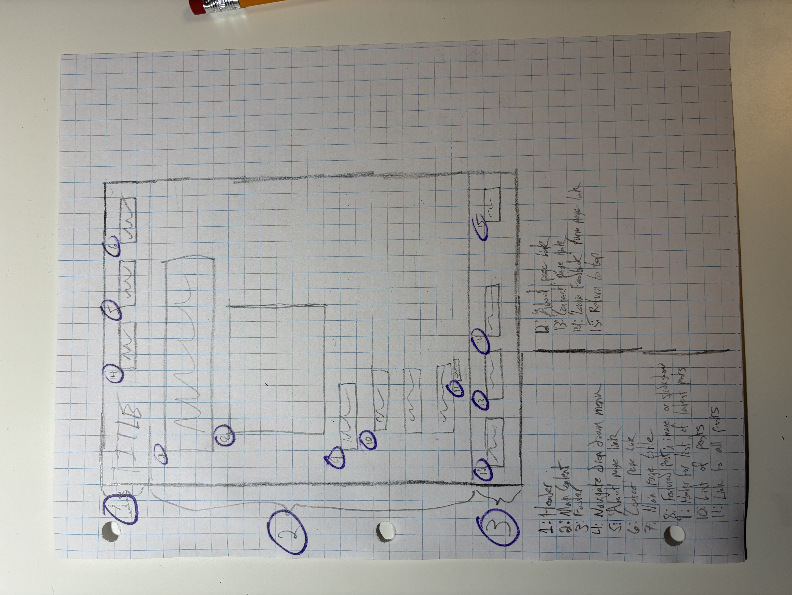
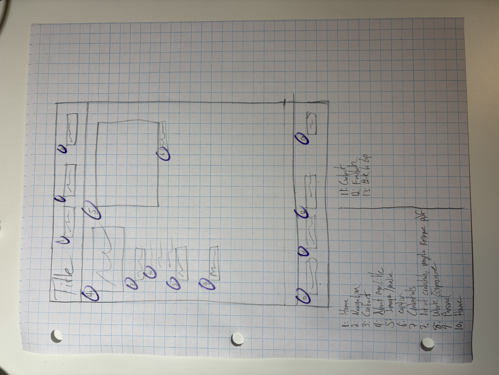
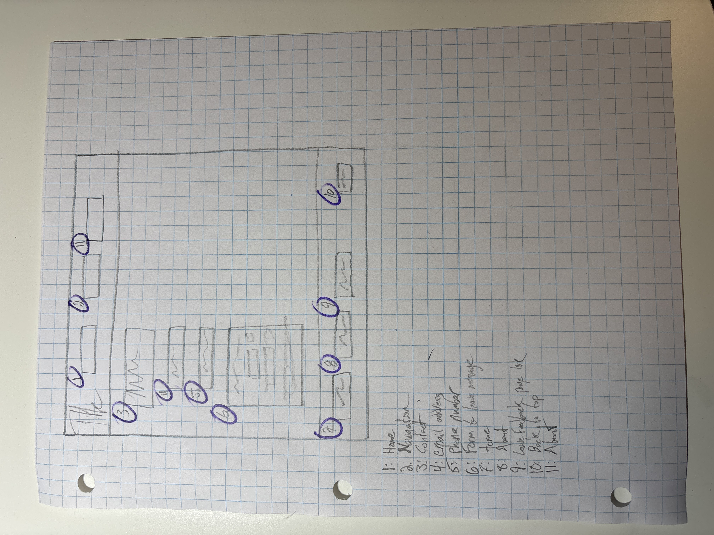

# George Kline's INF 6420 Project

A portfolio site with examples of my work and info about me.

## Wireframes

In order to start brainstorming and laying out the website, here are a few wireframes showing important pages and potential layouts.

Header: will consist of site title, navigation menu, and links to About page and Contact page.

Main Content: will give reason for site- why I care about and am equipped to do LIS jobs.

Main page title: may include a brief statement of purpose.

Featured post/image/slideshow: visual representation of the kinds of content on the site.

List of posts: introduces other pages or items without needing to decide to click, just scrolling down.

Footer: will include links to other key pages and an option to return to top of page.

Header: will be the same as the header for the main page, but replacing the link to the About page with a link to the home page.

About page title: may include some basic background information.

Image/media: something visual to represent the information I'm trying to convey.

Credentials: professional credentials, maybe resume pdf or education.

Work experience: relevant experience to LIS career.

Personal: some information about me, attempt to connect while remaining professional, maybe needs to be a link.

Footer: will have links to the home page, Contact page, possibly a form to leave feedback, back to top of page.

Header: will be the same as the header for the main page, but replacing the link to the Contact page with a link to the home page.

Contact title: introduce the best ways to get in touch with me.

Email address: perhaps include a business email address.

Phone number: maybe this should be removed, but the wireframe includes a space for a phone number.

Form to leave message: a space for someone to conviently leave a message and their email address.

Footer: will have links to the home page, About page, possibly a form to leave feedback, back to top of page.
